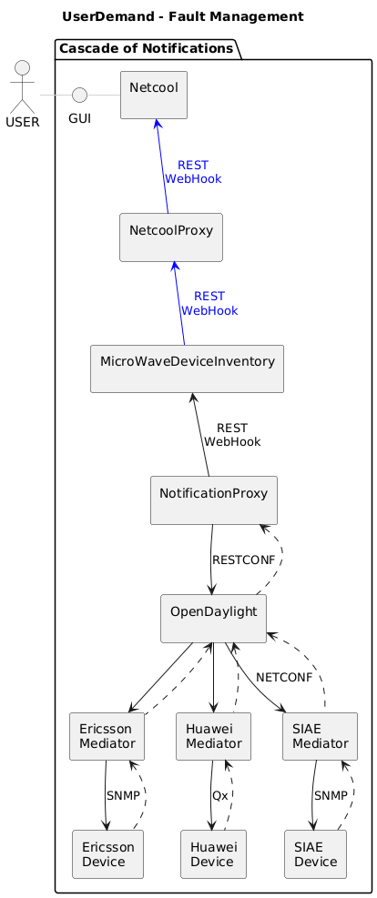
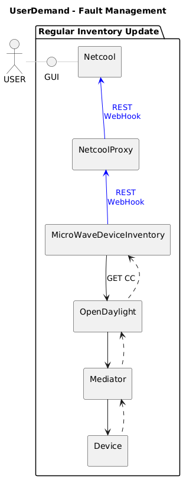
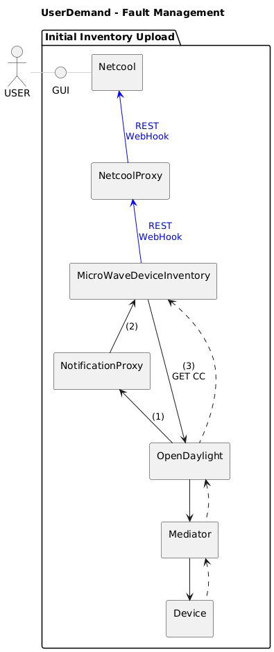

# _FaultManagement  
UserDemand for MW SDN based Fault Management  

### Scope  
The current ComarchOSS based Fault Management is to be replaced by a set of microservices integrated into the application layer of the MW SDN domain.  

While IBM Netcool Operations Insight will be used as a user front end to perform management tasks, alarm notifications, lists and histories will also be made generally available to the entire application layer for automation purposes.  

The following tasks need to be performed in the background  
 - Consolidate alarm notifications from all devices into a single stream  
 - Recompute the references within the device notifications to be unique in the network context and to match the inventory content  
 - [Confirm receipt of Huawei notifications]
 - Update alarm lists and histories in the inventory 
   - based on device notifications  
   - and based on regular upload of data tree  
 - Create alarm notifications based on changes within the inventory  
   - [Reduce the number of notifications through aggregation and suppression (2)]  
   - Offer subscriptions to all types of consumers  
 - Providing the alarm list of a specific device in the inventory (2)  
 - [Providing an extended history of events on a specific device (3)]  
 - Updating the alarm list of a dedicated device in the inventory with current device content based on request (2)  
 - Automatically read device content when a gap is detected in the sequence of device notifications (3)  
 - Provide a domain interface for Netcool  
   - Managing the address of its subscription  
   - Forwarding the notifications  
   - Making additional services accessible (2)  
  
The implementation of the tasks listed above follows an incremental approach.  
If not included in the initial setup, a number indicates the implementation phase.  
Not sure if the tasks in the square brackets are actually needed.    

### High Level Architecture  
It is important to note that the alarm notifications sent to the consumers (e.g. Netcool) have a slightly different meaning to those sent by the devices.  
In fact, these notifications indicate changes in the alarm lists of the devices in the inventory.  
The causes of these changes are hidden from the consumers.  
Changes might be caused by  
- Receipt of an alarm notification from a device  
- Updating the inventory based on an initial or a regular upload of the device's data tree  
- Uploading a specific alarm list after discovering that not all notifications have been received in the past  
- Other operations to improve data quality  

#### Notification Flow  
The following diagram shows the propagation of the device notifications (black chain) used to update the contents of the inventory.  
Changes to the inventory trigger inventory notifications (blue chain) that are delivered to consuming applications, such as Netcool.  

#### Regular Update  
The content of the inventory is replaced at regular intervals by an upload of the complete data tree from the device.  
Any differences between the stored alarm list and the new alarm list must be notified to the consumers.  
  

#### Initial Upload (at new or re-connected devices)  
Whenever the controller is notifying a device mount point changing into connected state (1), the inventory is uploading (3) and storing the entire data tree of this device.  
As there is no historical information, the inventory is creating notifications for every entry in the alarm list.  
_[Potential Problem: If alarms are cancelled during a temporary interruption of the DCN connection, this will not be reported in this process. Perhaps it would be better if the consumer would load the alarm list whenever he is informed about a new device.]_  

